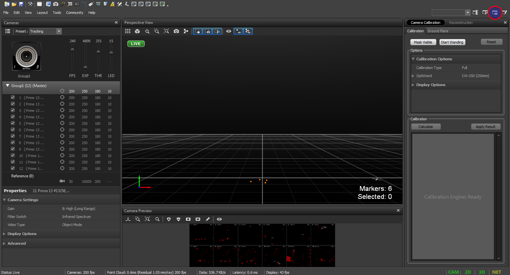
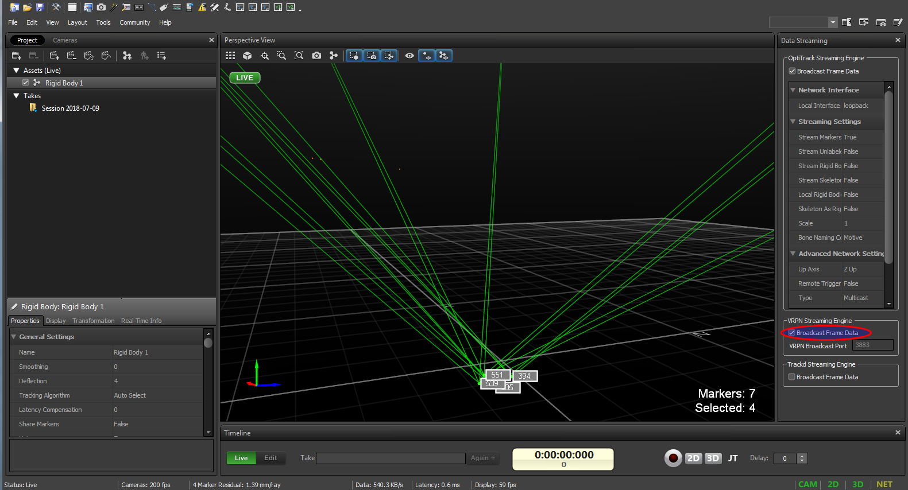
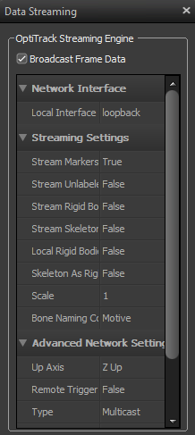
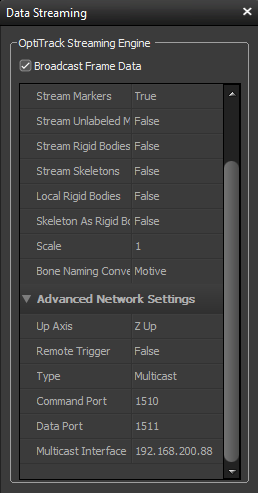
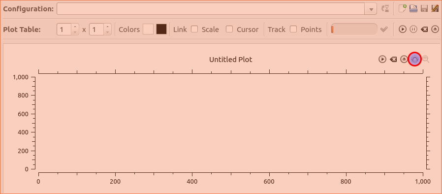
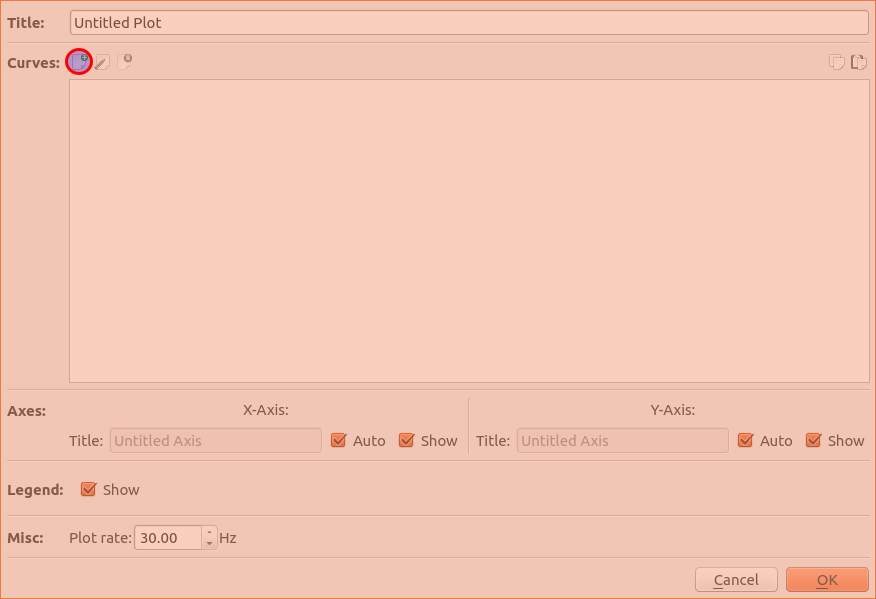
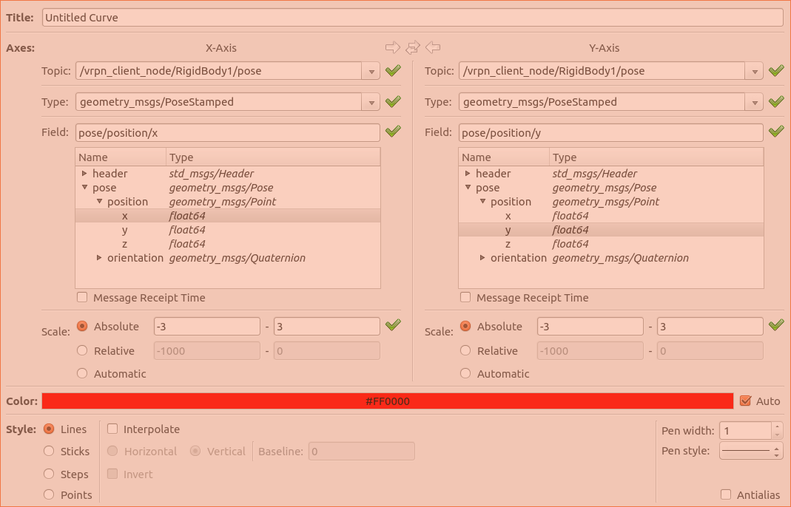
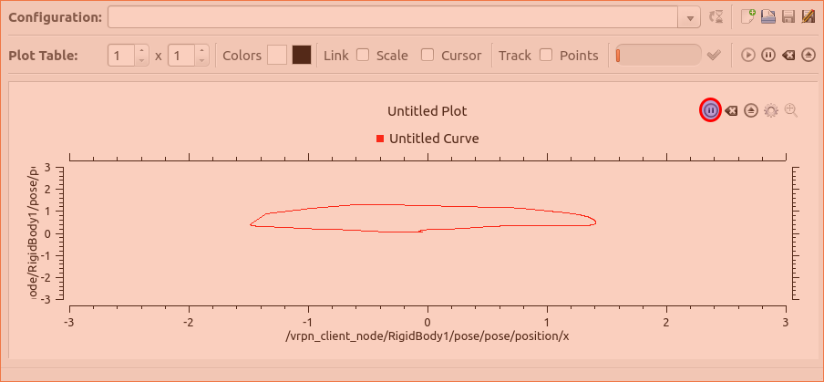

# usma_optitrack
## Overview
Instructions for configuring a Natural Point Optitrack motion capture system and VRPN client in order to stream pose data to ROS.
The goal is to track rigid bodies using the OptiTrack motion capture system and stream pose data (position and orientation) to a base station computer.
Required:
1. Mocap computer - Windows desktop running Motive and VRPN server
2. Base station - Ubuntu laptop running ROS and VRPN client

## Motion capture computer setup
1. Turn on motion capture cameras through powerstrip and launch Motive. 
   - There is a delay between turning on the cameras and the connection to Motive. Once the lights on the lower right corner of the cameras are blinking, they can be connected to Motive.
2. Open existing project and select calibration file (March 2018 file works well for general purposes). At this point, the blue lights on the cameras should activate.
3. Select Capture Layout found in the upper righthand corner shown below. 
4. Click and drag over the markers of a single body. Right click on the selected body and choose Rigid Body -> Create From Selected Markers. Repeat for all desired bodies. (keep in mind that the orientation they are created in will be used as no rotation).
5. Open View -> Data Streaming
   - Assign each rigid body a unique "Name" field (found in the lower left corner). This is the ID that mocap\_optitrack will use to identify them and the ROS topic they will be published to.
   - If an offset is required, click the "Transformation" tab (again in the lower left corner) and offset the pivot points of rigid bodies to reflect actual positions of the object they represent.
   - To ensure data is streaming properly, click the "Real-Time Info" tab then move your rigid body and observe if it is moving as expected. (The axes on this computer will not be the same as those published to ROS so don't worry if these axes are not aligned as desired).
   - In the "Data Streaming" portion (on the righthand side of the window), ensure that the "VRPN Streaming Engine - Broadcast Frame Data" is enabled.  
   - Still in the "Data Streaming" section, scroll through the "Optitrack Streaming Engine" portion. The inputs should match the following  
      
   The most important fields (and the ones that require change from their possible default setting) are "Stream Unlabled Markers" should be "False", "Stream Rigid Bodies" - "True", "Up Axis" - "Z Up" (this will cause a rotation about the X Axis to get Z Up), and the "Multicast Interface" should have the address 192.168.200.XX (this is the DS3 network).
6. Switch to Ubuntu computer

## Base station setup [[ref]](http://wiki.ros.org/vrpn_client_ros)
On a laptop with Ubuntu 16.04 and ROS Kinetic:
1. Clone this repositiory to your catkin workspace
``` 
cd ~/catkin_ws/src
git clone 
cd ..
catkin_make
```
2. Ping the IP of the Motive computer using `ping 192.168.200.99`  
   - The IP was 192.168.200.99 when connected to DS3, which is the IP used in the launch file. If there is no response, check the IP of the Motive computer by going to the command terminal and using the command `ipconfig/all` and finding the "IPv4 Address"
3. Launch the basic.launch file: `roslaunch usma_optitrack sample.launch`
4. Data can be visualized using `rosrun rqt_multiplot rqt_multiplot` (Multiplot plugin must be installed for rqt)
   - Go to settings  
   
   - Add new curve  
   
   - Choose topic and field to plot and choose graph window size (graph window defaults to automatic)  
   
   - Hit enter and go back to graph output window. Hit play to display current data output  
   
